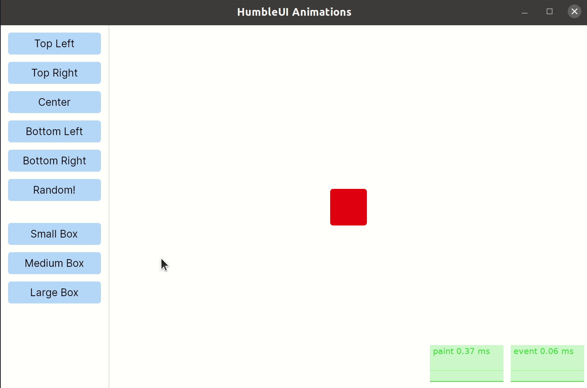

# Animations in HumbleUI

This repo is an example of doing animations in [HumbleUI].

[HumbleUI]:https://github.com/HumbleUI/HumbleUI

## Demo

> Please note the .gif image below does not show animations at their full frame-rate.



A higher frame-rate example can be found [here] or [online].

[here]:images/2022-09-24-humbleui-animations.webm
[online]:https://oakmac.com/2022-09-24-humbleui-animations.webm

## Development

Make sure that [Clojure v1.11.1](https://clojure.org/releases/downloads) is installed, then:

```sh
## run the program
./script/run.sh

## Run a REPL
clj -M:env/dev:repl/rebel
```

## Future Development / TODO

- [ ] publish as a generic library
- [ ] performance analysis and tweaking of the `tick!` function

## License

[ISC License](LICENSE.md)
